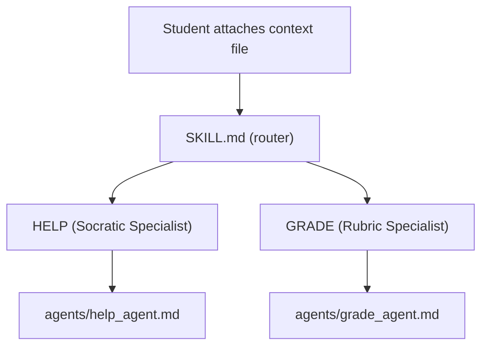

# Contributing to REVA C Tutor

This document provides technical details for developers, faculty, and anyone wishing to contribute to the REVA C Tutor project.

---

## Agent Architecture

The system uses a modular agent design to maintain high specialized performance while minimizing token usage.



**Token Efficiency Design**: The master `SKILL.md` is ~250 tokens. Only the relevant specialist agent is loaded per invocation (~500 tokens). The full 1300-line specification is never loaded during normal operation.

---

## Directory Structure

```
reva-c-tutor/
├── SKILL.md                    ← Master agent router (read this first)
├── reva-c-tutor-agent.md       ← Full specification and pedagogy
│
├── agents/
│   ├── help_agent.md           ← Socratic help specialist
│   └── grade_agent.md          ← Grading specialist
│
├── scripts/                    ← Data layer (no LLM calls)
│   ├── init_student.py         ← Register a new student
│   ├── next.py                 ← Assign next exercise
│   ├── help.py                 ← Generate help context block
│   ├── grade.py                ← Generate grade context block
│   ├── parse_exercise_filename.py
│   ├── compile_check.py
│   ├── check_style.py
│   └── make_template.py
│
├── exercises/
│   ├── prerequisites.json       ← Prerequisite exercises
│   ├── practice.json            ← Extra practice exercises (syllabus-aligned)
│   ├── advanced.json            ← Advanced practice exercises
│   └── lab_programs.json        ← 10 mandatory lab programs
│
├── student_data/                ← Consolidated folder for student runtime data (git-ignored)
│   ├── progress/                ← Per-student progress JSON
│   └── sessions/                ← Session logs per student
│
├── config/
│   └── agent_config.json
├── rubrics/
│   └── rubric_master.md
├── docs/
│   ├── coding_style_guide.md   ← S01–S10 rules with examples
│   └── syllabus.md             ← Progressive unlocking logic
└── .vscode/
    └── tasks.json              ← VS Code task runner shortcuts
```

---

## Syllabus Coverage (8 Units, 20 Topics)

| Unit | Topics |
|---|---|
| 1 — Basics | INTRO, DTYPES, OPS, IO |
| 2 — Control Flow | COND, LOOP, JUMP |
| 3 — Functions | FUNC, SCOPE, RECUR |
| 4 — Arrays & Strings | ARRAY, STRING |
| 5 — Pointers | PTR, PTRARR, PTRF |
| 6 — Structures | STRUCT, UNION, ENUM |
| 7 — File I/O | FILE |
| 8 — Dynamic Memory | DYNMEM |

Topics unlock progressively: a unit must be mastered (`demonstrated_level=3` for all topics) before the next unit's topics become available.

---

## For Faculty & Contributors

### Adding Exercises
Exercises are stored in the `exercises/` directory as JSON files. When adding new exercises, follow the schema defined in `reva-c-tutor-agent.md`.

### Modifying Agents
Specialist agents in `agents/` define the "personality" and rules for the AI. Changes here should prioritize the Socratic method (guiding, not telling).

### System Debugging
If a script fails:
- Student progress is in `student_data/progress/<student_id>.json`
- Session logs are in `student_data/sessions/<student_id>/`
- The grading rubric is in `rubrics/rubric_master.md`
- Run scripts with Python debugging (use `-m pdb` or add print statements)

### Technical Dependencies

| Tool | Version | Purpose |
|---|---|---|
| gcc | ≥ 9.0 | Compile student code |
| cppcheck | ≥ 2.0 | Style checking (S01, S04, S05, S07, S09) |
| jq | ≥ 1.6 | JSON parsing in bash scripts |
| python3 | ≥ 3.8 | Exercise template generation |
| bash | ≥ 4.0 | All shell scripts |

---

*REVA University | School of Computer Science and Engineering | AY 2025-26*
